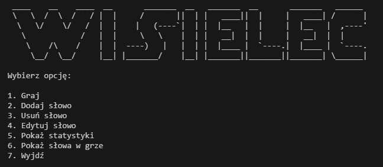

# 2. Gra w Wisielca

## Spis treści
1. [Opis projektu](#opis-projektu)
2. [Funkcjonalności](#funkcjonalności)
3. [Instrukcja obsługi](#instrukcja-obługi)
4. [Wymagania systemowe](#wymagania-systemowe)
5. [Screenshot](#screenshot)

## Opis projektu
Projekt "Gra w Wisielca" to konsolowa implementacja popularnej gry słownej w Javie. Gracze mają za zadanie odgadnąć ukryte słowo, podając litery. Gra pozwala na zarządzanie słowami w bazie danych oraz na śledzenie statystyk gier.

## Funkcjonalności
- **Graj:** Rozpoczyna nową grę, po wyborze poziomu trudności.
- **Dodaj słowo:** Umożliwia dodanie nowego słowa do bazy danych.
- **Usuń słowo:** Pozwala usunąć wybrane słowo z bazy danych.
- **Edytuj słowo:** Umożliwia edycję wybranego słowa w bazie.
- **Pokaż statystyki:** Wyświetla statystyki gier, takie jak liczba gier wygranych i przegranych oraz średnia liczba prób na grę.
- **Pokaż słowa w grze:** Wyświetla wszystkie słowa dostępne w grze.

## Instrukcja obsługi
### Jak uruchomić
1. Zainstaluj środowisko Java, jeśli nie jest jeszcze zainstalowane.
2. Sklonuj repozytorium lub pobierz pliki projektu.
3. Otwórz terminal w folderze projektu.
4. Skompiluj projekt używając polecenia:
```bash
javac Hangman.java
```
5. Uruchom grę poleceniem:
```bash
java Hangman
```

### Instalacja dodatkowych pakietów
Gra wymaga zainstalowanego JDK (Java Development Kit), które można pobrać z oficjalnej strony Oracle lub za pośrednictwem menedżerów pakietów w różnych systemach operacyjnych.

## Wymagania systemowe
- Java 11 lub nowsza

## Screenshot
